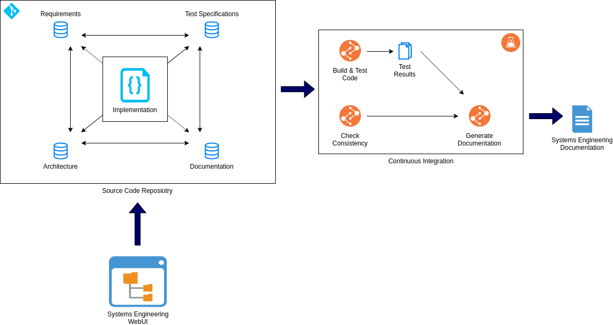

# Software-Engineering-as-Code

Model complex software systems with a textual representation next to the code using GIT for version control and persistency.

## Motivation

Software engineering is a discipline to design software systems from requirements engineering and test specification over architecture down to the implementation and documentation of the individual building blocks (e.g. software comonents).
Different tools exist to model the artifacts of the involved engineering stages, typically with a central database for persistency, access and version control.
This project takes a different approach to keep the software engineering artifacts in a textual representation close to the code and provide advanced web-based and CI-based tooling to ease the use.

## Components

The project *Software-Engineering-as-Code* splits into the components `core` and `web-ui`.
This repository contains the `core` component, while the `web-ui` component is available in a dedicated repository at [Software-Engineering-as-Code Web-UI](https://github.com/software-engineering-as-code/web-ui).

# Core

The `core` component is the base layer for *Software-Engineering-as-Code* that provides:

* Data models for artifacts (requirements, test specifications, etc.).
* Generator for markup language.
* Commandline tooling to check data consistency and formatting.
* Backend server to enable communication with `web-ui` for UI-based modification of artifacts.

# Documentation

The full documentation for the `core` component is available at:
